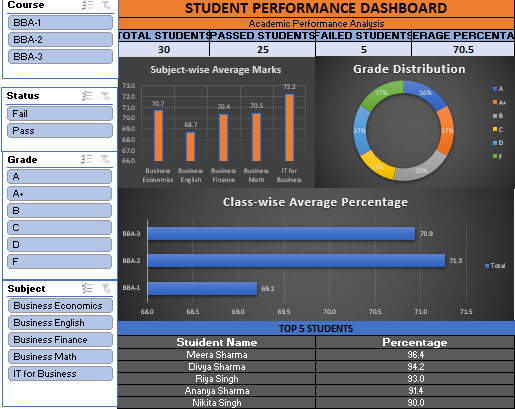
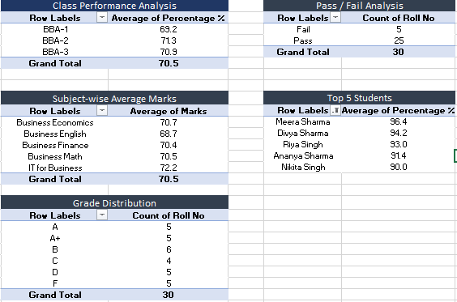
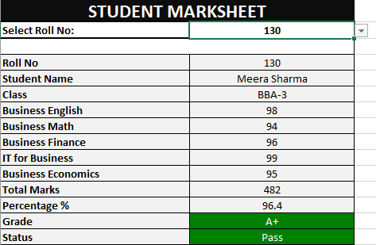

# Student Performance Analysis Dashboard-

An interactive Student Performance Analysis Dashboard and Printable Marksheet built using Microsoft Excel.

## 📊 Project Overview

This project analyzes the academic performance of 30 students across multiple subjects and classes.

The workbook combines Excel formulas, Power Query, PivotTables, PivotCharts, slicers, conditional formatting, and lookup functions to create an interactive analytical dashboard and automated student marksheet.

## 🎯 Project Objectives

- Analyze student academic performance
- Calculate total marks and percentages automatically
- Classify students by grade and pass/fail status
- Compare subject-wise performance
- Analyze class-wise performance
- Visualize grade distribution
- Identify the top-performing students
- Create an automated printable marksheet

## 🛠️ Tools & Excel Skills

- Microsoft Excel
- Excel Tables
- Data Validation
- Conditional Formatting
- Excel Formulas
- IF / Nested IF
- SUM
- AVERAGE
- COUNTIF
- VLOOKUP
- Power Query
- Data Cleaning
- Data Unpivoting
- PivotTables
- PivotCharts
- Slicers
- Dashboard Design
- Print & Page Layout

## 📈 Dashboard Features

### Key Performance Indicators

- Total Students
- Passed Students
- Failed Students
- Average Percentage

### Visual Analysis

- Subject-wise Average Marks
- Grade Distribution
- Class-wise Average Percentage
- Top 5 Students

### Interactive Filters

The dashboard includes slicers for:

- Course/Class
- Status
- Grade
- Subject

## 📝 Automated Printable Marksheet

The workbook includes a dynamic printable marksheet.

By selecting a student's Roll No., the marksheet automatically retrieves:

- Student Name
- Class
- Subject Marks
- Total Marks
- Percentage
- Grade
- Pass/Fail Status

VLOOKUP is used to retrieve student information from the main dataset.

## 🔄 Data Preparation

Power Query was used to transform the subject-level data by unpivoting subject columns into an analysis-friendly structure.

This structure supports flexible PivotTable and PivotChart analysis.

## 📷 Project Screenshots

### Dashboard

### Data Analysis

### Printable Marksheet

## 📁 Project Files

## 📁 Project Files

| File | Description |
|---|---|
| [Student_Performance_Dashboard.xlsx](Student_Performance_Dashboard.xlsx) | Complete Excel workbook |
| [dashboard.png](dashboard.png) | Interactive dashboard screenshot |
| [data-analysis.png](data-analysis.png) | Data analysis screenshot |
| [printable-marksheet.png](printable-marksheet.png) | Printable marksheet screenshot |

## 💡 Key Learning

This project demonstrates how Excel can be used as an end-to-end data analysis tool, from data preparation and transformation to analysis, visualization, and automated reporting.

## 👤 Author

**Ashalan Ahamed Ashrafi**

BBA Student | Finance & Data Analytics

**Skills:** Excel | SQL | Power BI | Finance & Analytics
